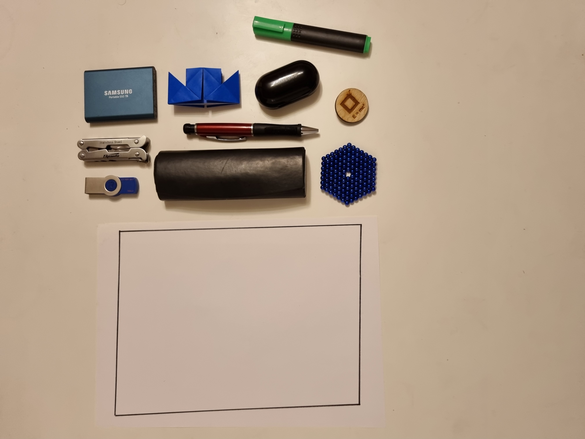
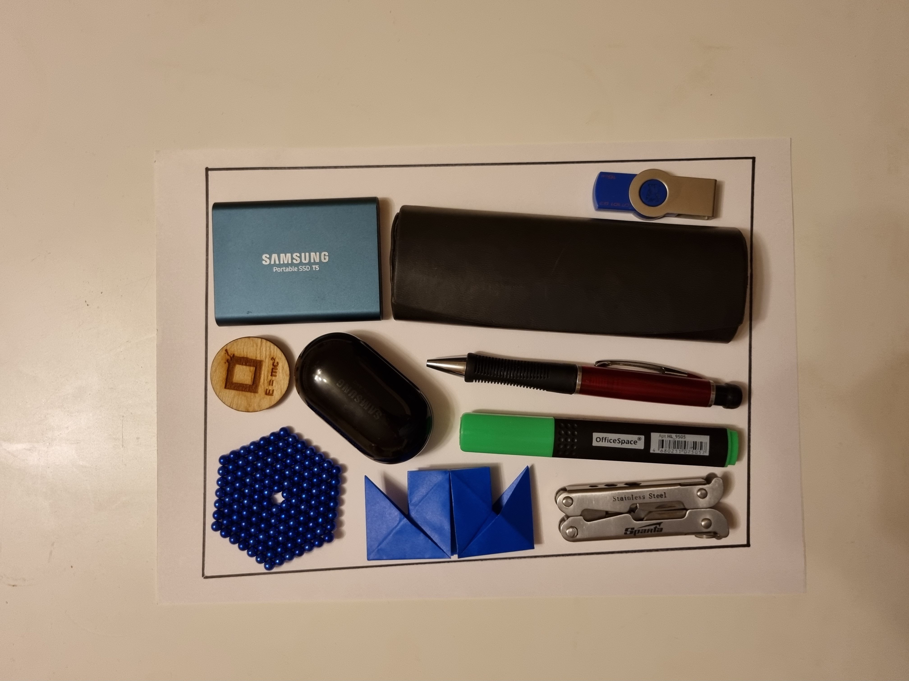
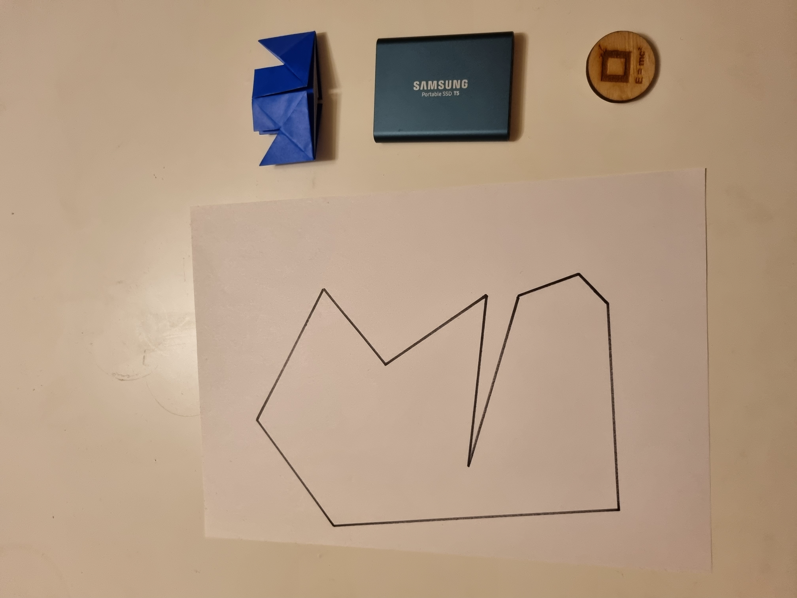
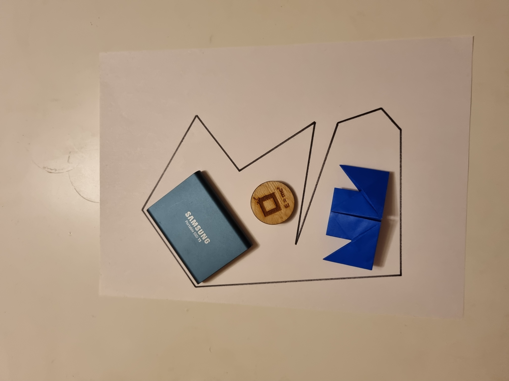
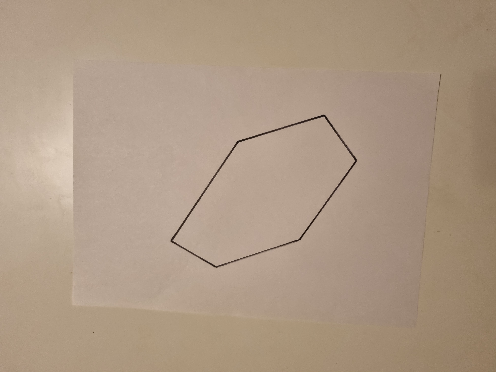
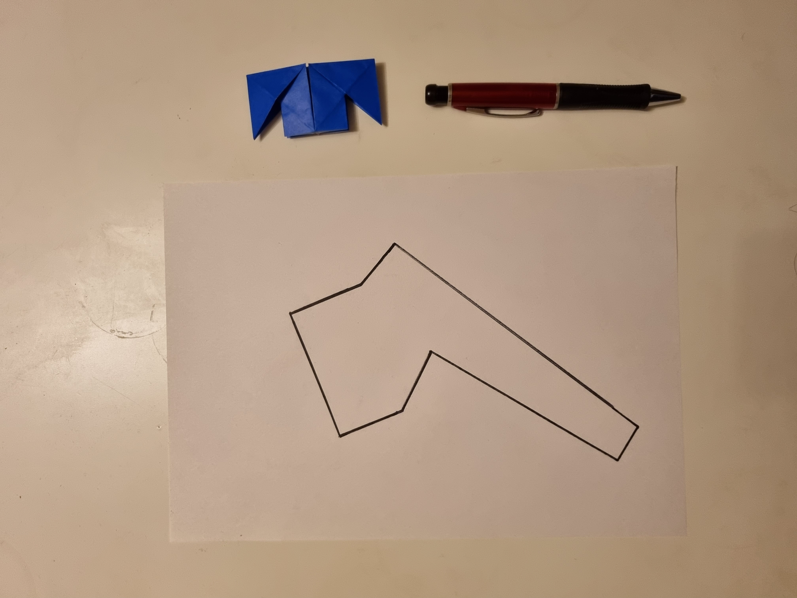
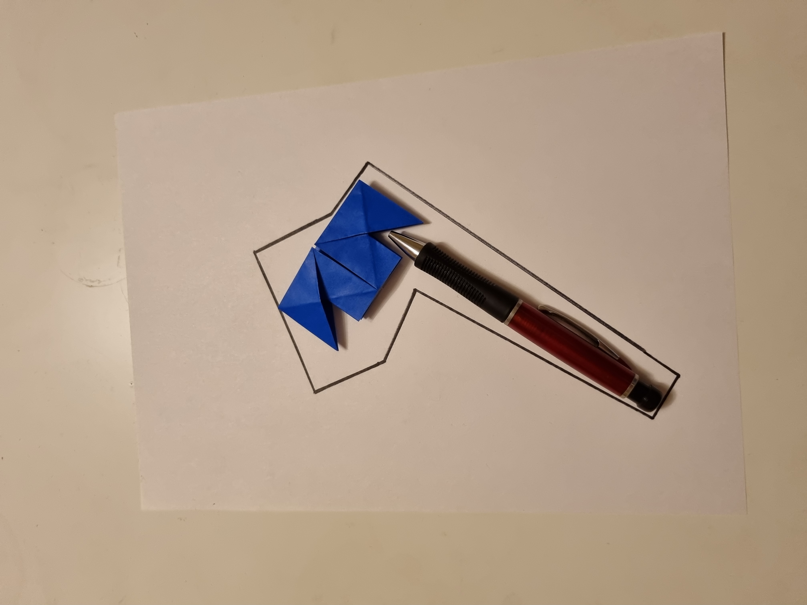
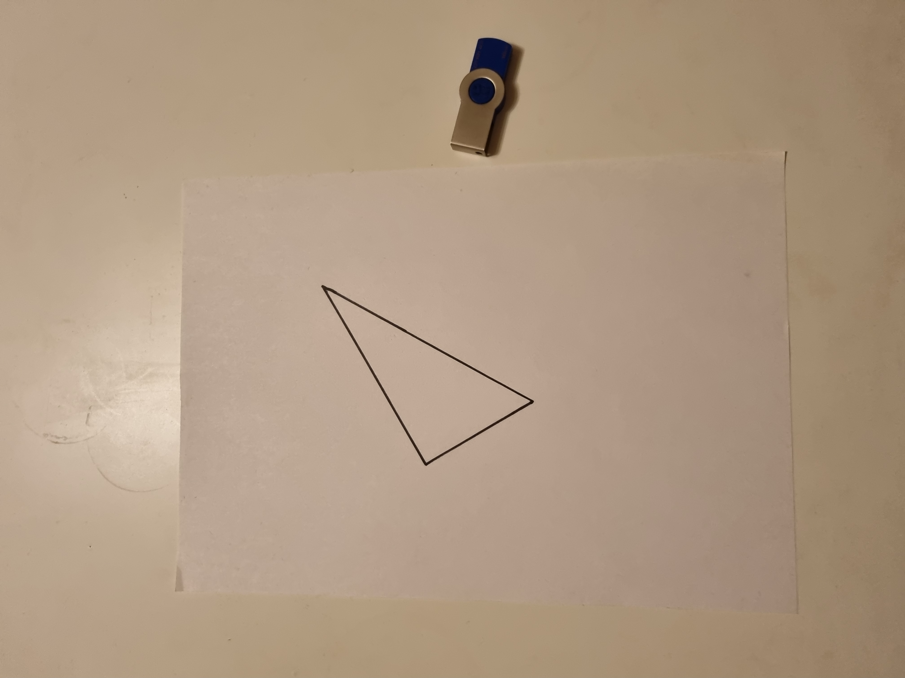
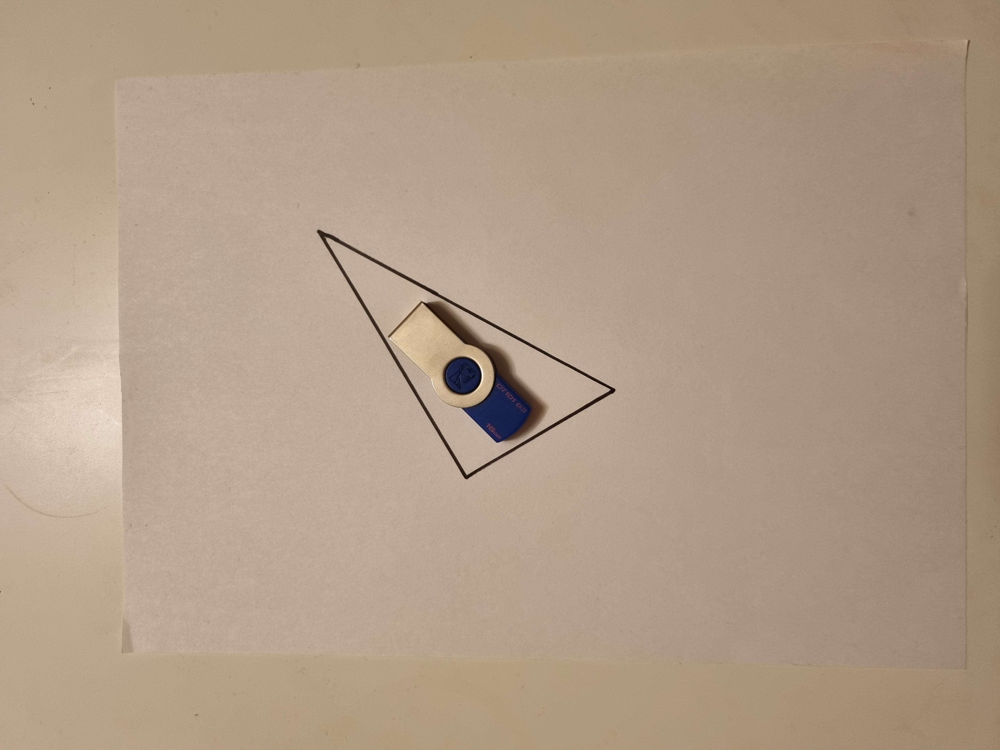

# Intelligent_Placer

## Постановка задачи
Требуется создать “Intelligent Placer”: по поданной на вход фотографии нескольких предметов на светлой горизонтальной поверхности и многоугольнику понимать, можно ли расположить одновременно все эти предметы на плоскости так, чтобы они влезли в этот многоугольник. Предметы и горизонтальная поверхность, которые могут оказаться на фотографии, заранее известны. Также заранее известно направление вертикальной оси Z у этих предметов. Многоугольник задается фигурой, нарисованной темным маркером на белом листе бумаги, сфотографированной вместе с предметами. “Intelligent Placer” должен быть оформлен в виде python-библиотеки <b>intelligent_placer_lib</b>, которая поставляется каталогом <b>intelligent_placer_lib</b> с файлом <b>intelligent_placer.py</b>, содержащим функцию - точку входа

```python
def check_image(<path_to_png_jpg_image_on_local_computer>[, <poligon_coordinates>])
```

которая возвращает True если предметы могут влезть в многоугольник, иначе False. То есть так, чтобы работал код:

```python
from intelligent_placer_lib import intelligent_placer
def test_intelligent_placer():
	assert intelligent_placer.check_image(“/path/to/my/image.png”)
```

Также требуется воспроизводимый intelligent_placer.ipynb, содержащий репрезентативные примеры работы алгоритма с оценками качества его работы и их визуализацией.

### Описание входных данных
- Допустимое разрешение входных фотографий: не менее 1280х1280;
- Высота съемки: не менее 40 см (в общем случае - достаточная для размещения листа А4 и некоторого количества предметов);
- Угол наклона камеры: не более 10 градусов (в идеале 0 дабы избежать нежелательных теней);
- Степень размытости фотографии: фотография должна быть максимально чёткой для беззатруднительного зрительного определения границ предметов
- Допустимые форматы фотографий: png, jpg;
- Размещение предметов: вне листа с многоугольником, без перекрытия, с интервалом ~ 2см между предметами;
- Размещение листа с многоугольником: приблизительно в центре фотографии, ориентация - документ (самая длинная сторона - приблизительно вертикально относительно фотографии);
- Параметры многоугольника: нарисован тёмным маркером (ручкой) на белом листе формата А4, количество вершин - не более 10;
- Параметры фона: предмет (покрытие) сплошного светлого (близкого к белому) цвета;
- Дополнительно: 
  - Несколько экземпляров одного предмета не допускаются;
  - Во избежание возникновения теней рекомендуется воспользоваться несколькими источниками света;

### Описание выходных данных
True если предметы могут быть размещены в многоугольнике без наложений, иначе False

### Решаемые задачи
1. Задача определения многоугольника
2. Задача определения предмета
3. Задача укладки (иными словами, наиболее эффективное с точки зрения постановки задачи расположение предметов в многоугольнике)

В первую задачу входит определение многоугольника на заданной фотографии и создание его программной модели по найденным параметрам.
Вторая задача включает в себя обнаружение предметов, определение их параметров с последующим созданием модели.
Третья задача по сути основная - разработка алгоритма, позволяющего при произвольном входе, удовлетворяющем требованиям, выдать ответ.

## Сбор данных
### Рассматриваемые объекты
#### Футляр для очков

#### Автокарандаш

#### Оригами

#### Кейс от беспроводных наушников

#### Внешний диск

#### Неокуб

#### Флешка

#### Значок

#### Мультитул

#### Текстовыделитель

#### Поверхность съемки


### Примеры
#### Пример 1
##### Вход: 

##### Получившийся результат:
True
##### Вариант размещения:

##### Комментарий:
3 предмета, помещающихся в заданный невыпуклый многоугольник

#### Пример 2
##### Вход: 

##### Получившийся результат:
False
##### Комментарий:
2 предмета, непомещающийся в заданный многоугольник

#### Пример 3
##### Вход: 

##### Получившийся результат:
True
##### Вариант размещения:

##### Комментарий:
2 предмета, помещающихся в заданный невыпуклый многоугольник

#### Пример 4
##### Вход: 

##### Получившийся результат:
True
##### Вариант размещения:

##### Комментарий:
Тривиальный пример, 1 предмет, помещающийся в область

#### Пример 5
##### Вход: 

##### Получившийся результат:
True
##### Вариант размещения:

##### Комментарий:
4 предмета, помещающихся в область

#### Пример 6
##### Вход: 

##### Получившийся результат:
True
##### Вариант размещения:

##### Комментарий:
Крайний случай 10 предметов

#### Пример 7
##### Вход: 

##### Получившийся результат:
True
##### Вариант размещения:

##### Комментарий:
Крайний случай 10-угольник

#### Пример 8
##### Вход: 

##### Получившийся результат:
False
##### Вариант размещения:

##### Комментарий:
Крайний случай - 0 предметов

#### Пример 9
##### Вход: 

##### Получившийся результат:
True
##### Вариант размещения:

##### Комментарий:
Вариант "стыковки" предметов

#### Пример 10
##### Вход: 

##### Получившийся результат:
True
##### Вариант размещения:

##### Комментарий:
Крайний случай - треугольник